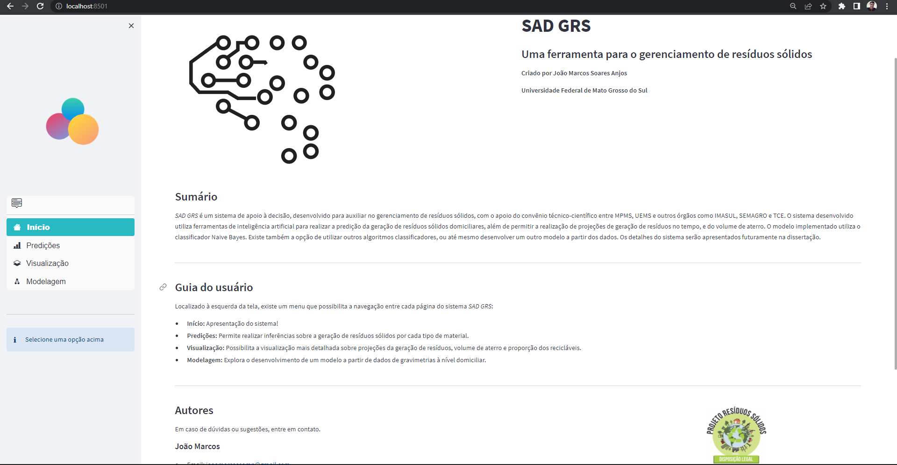

# Decision Support System Based on Artificial Intelligence for Solid Waste Management

## Design of a Decision Support System, based on Artificial Intelligence algorithms, developed to assist decision makers in the area of solid waste.

The system was created based on artificial intelligence/machine learning algorithms, which makes it capable of making accurate predictions about the amount and characterization of waste generated.

### Preview image of the DSS home page

  

For the creation of this system, a field survey was carried out in the city of Campo Grande, Mato Grosso do Sul, where data regarding the generation of solid waste in 158 households were collected. The collected data were used to build prediction models through regression and classification techniques.

The following models were developed:

* Neural Network - for regression -
* Decision Tree
* Naive Bayes
* KNN
* SVM

The interface was build using an open source framework called streamlit.

## How to install this project

1. Install python
2. Clone this project

To configure the project, simply install the dependencies contained in the requirements.txt file as follows:

3. `pip install -r requirements.txt`

To run the project, go to the folder "/SADGRS" and type the follow:

4. `streamlit run home.py`

This code comprises the initial version of the project, which is still under development.
Some important and sensitive research data has been removed. For more information, contact:
joaomarcoscomp@gmail.com
